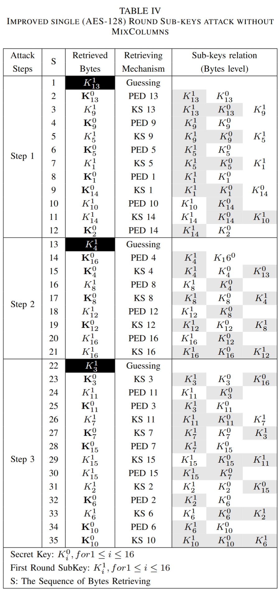

# Shmooving 3

Author: `_mac_`

You're probably tired of it, but I've made AES so fast now. It only takes 1/10th of the time it took before!

## Solution
This challenge implements AES-128-ECB, but the number of rounds is dependent on the index of the block. We get an encryption oracle for up to 10 blocks before we're asked to decrypt a 10-block challenge encrypted with the same key. Since the index of the first block is zero, the round loop will be completely skipped, and the only operations done on it are:
1. add first round key
2. apply substitution box
3. shift rows
4. add second round key

In other words, this is basically one round of AES (without the MixColumns operation), so I started googling and found this [crypto SE post](https://crypto.stackexchange.com/questions/80743/one-round-of-aes-128). The top answer describes an attack (with MixColumns) for recovering the key given 2 plaintext/ciphertext pairs, but we only have 1 pair (without MixColumns). The other answers also described attacks for a single pair, but I didn't bother trying to figure out how to adapt their listed strategies/code to not account for MixColumns. However, the last answer had an interesting reference:
> There is a paper called [Low Data Complexity Attacks on AES](https://eprint.iacr.org/2010/633.pdf) by Bouillaget et al. It describes best attacks on 1-4 rounds of AES with only 1-9 known/chosen plaintexts.

After some light skimming, I found yet another interesting reference within the paper:
> We note that the problem of attacking one round AES without the MixColumns operation with a single known plaintext is studied in [25]. It is shown that 2^16 encryptions are sufficient to retrieve the key.

This led me to find [The Effects of the Omission of Last Round's MixColumns on AES](https://www.sciencedirect.com/science/article/pii/S0020019010000335). The approach was similar to the attacks first described on the SE post; you derive bytes of the first and second subkeys using relations imposed by the key schedule and encryption/decryption, guessing bytes where necessary and checking the results of said guesses with different relations to verify correctness. While reading, I also found [On the security of inclusion or omission of MixColumns in AES cipher](https://www.semanticscholar.org/paper/On-the-security-of-inclusion-or-omission-of-in-AES-AlMarashda-Alsalami/e13e7d71861290e218b57307a09dda040978375f). This paper described an attack that marginally improved the algorithm of the previous one, and the authors also described their approach in more detail, so I settled on using it for my solve.

For the actual solve, I implemented the attack by following this table from the paper:

Unfortunately, I had to figure out the relations myself (they weren't explicitly stated in the paper), and the attack could still produce multiple candidate keys that would work for the first block. To find the unique key that actually worked, my strategy was to re-encrypt the blocks I sent to the oracle, then check if they matched the response. To handle encryption and decryption, I adapted https://github.com/bozhu/AES-Python. Full details can be found in `solve.py`.

Flag: `gigem{r3duc3d_r0und_aes_1s_b4d}`

