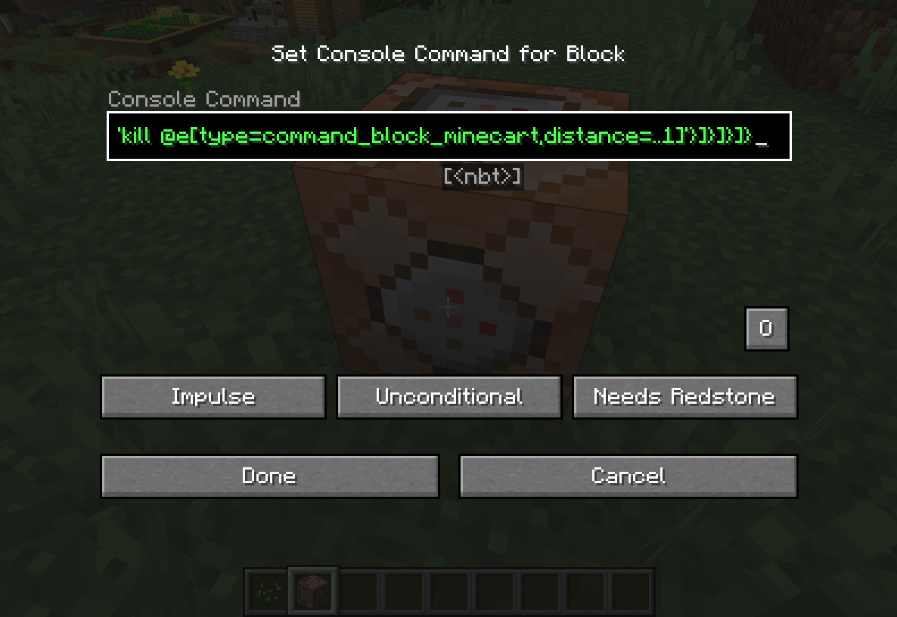
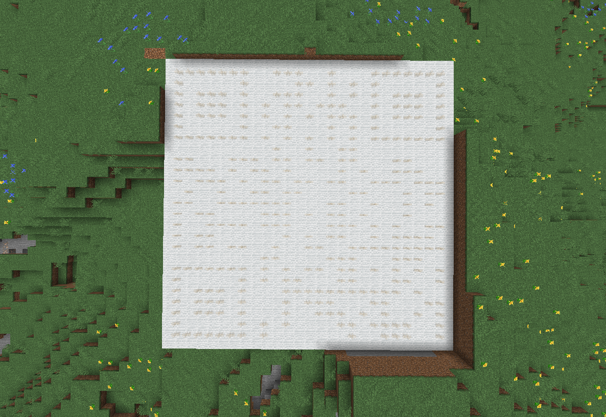
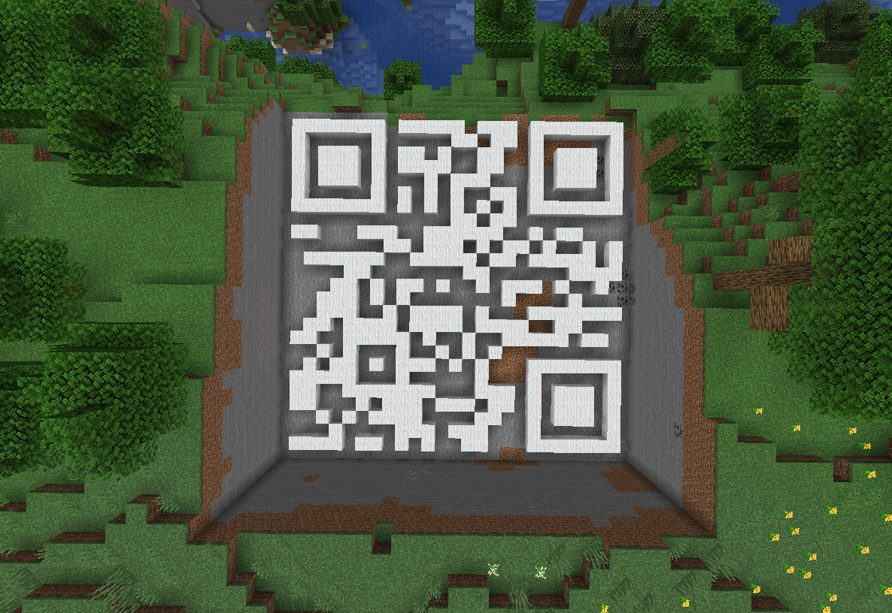
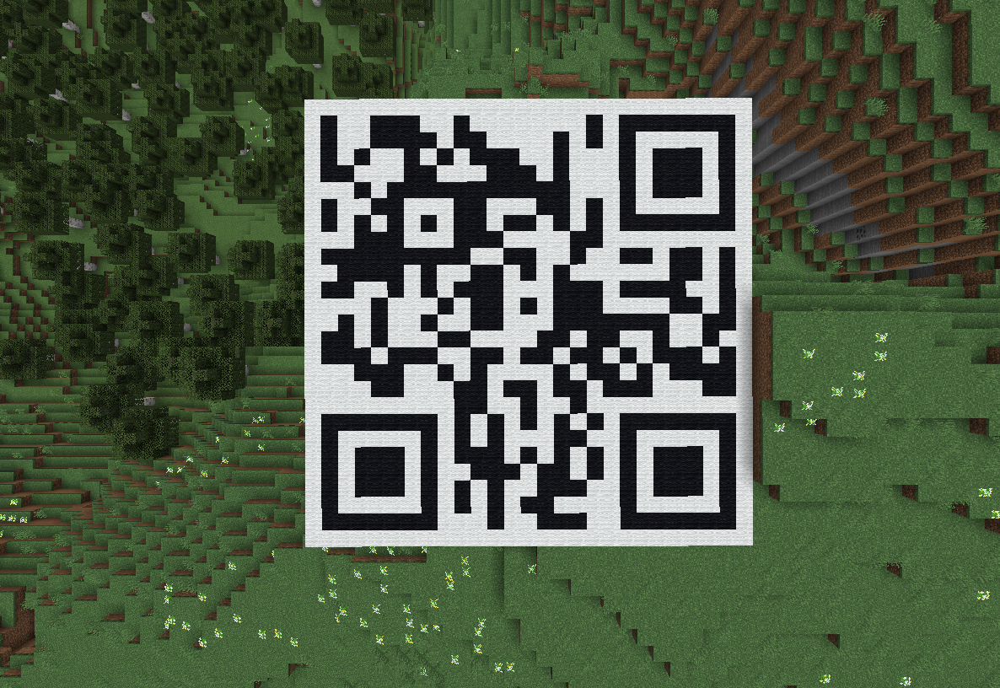

# Gamer Redux

Author: `nhwn`

My friend, David, was last online 7 years ago, but it appears he left behind a weird file for me. Can you recover his message?
## Dev Notes
You just get `sus.txt`. This is solvable both dynamically and statically. Dynamic cheese is encouraged!
## Solution
This command is an absolute monstrosity. I imagine that you could probably parse out the coordinates, but I couldn't be bothered so it's cheese time.

I found a couple of funny solutions that made this challenge *tr\*vial* by either modifying the command itself or running my own commands in the game after running the initial command.

To run the command in `sus.txt`, I just pasted the command inside of a command block and used a button to activate it.



This resulted in a message being displayed in chat and a large square of wool being placed on the ground. When walking over the white square, certain blocks in a 5-block radius are changed from white to black. When the player moves away from the white square, the all-black blocks are changed back to white blocks.



The command itself is spawning multiple command block minecarts that, when activated, spawn invisible armor stands at specific coordinates. The last thing that the command does is set up two repeated `execute` commands to replace the wool colors based on the player's proximity to an armor stand.

There are several possible solutions to this challenge that involve either running additional commands in-game or modifying the original command.

The solution that I found using additional in-game commands involved replacing all of the white wool blocks with air, which allowed me to get just the blocks that were being replaced. This revealed a QR code that could be scanned to reveal the flag.

```
/fill ~ ~ ~ ~30 ~ ~30 minecraft:air replace minecraft:white_wool
```



The easiest solution that I found for modifying the original command was changing the `execute` command that would replace the block at an armor stand. By changing `white_wool` to `black_wool`, the full QR code was visible from any distance.

```
{id:command_block_minecart,Command:'setblock ~ ~-5 ~-1 repeating_command_block{Command:"execute at @a at @e[type=armor_stand,distance=6..50] run setblock ~ ~ ~ black_wool",auto:1}'}
```



Scanning the QR code provides the flag.

Flag: `gigem{cr33p3r_4w_m4444n}`
