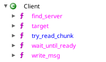

# absolute-cap

Author: `Addison`

Look, I tried to write some flavour text for this challenge, but it's really a straightforward blind reversing
challenge. We've provided you with two binaries, both present and running on the server. Connections to the server
connect to the "server" binary. **There are no other binaries present on the server, not even system utilities**.

Breathe, step back, and enjoy a little Rust reversing. :)

## Solution

A quick inspection of the `server` binary indicates that the server accepts a command, `execute`, followed by a size
indicator, followed by an ELF to be executed. Whatever we end up doing, we'll need to send a binary to the server to be
executed. A quick test binary shows that there is very little present in the container: `friend`, `server`, `flag.txt`,
and `/proc`. `flag.txt` cannot be read, giving a "permission denied" error. It seems that we will have to reverse
`friend` in order to determine what our binary must do.

With the `friend` binary being written in Rust, it makes it relatively difficult to reverse. However, we can piece
together what this binary does by inspecting its runtime behaviour. To start with, let's look at strace:

```c
open("/proc/14135/timerslack_ns", O_RDONLY|O_CLOEXEC) = 3
fcntl(3, F_SETFD, FD_CLOEXEC)           = 0
fstat(3, {st_mode=S_IFREG|0666, st_size=0, ...}) = 0
read(3, 0x555555aa5160, 32)             = -1 EPERM (Operation not permitted)
close(3)> >     = 0
open("/proc/14168/timerslack_ns", O_RDONLY|O_CLOEXEC) = 3
fcntl(3, F_SETFD, FD_CLOEXEC)           = 0
fstat(3, {st_mode=S_IFREG|0666, st_size=0, ...}) = 0
read(3, 0x555555aa5160, 32)             = -1 EPERM (Operation not permitted)
close(3)> >     = 0
open("/proc/14171/timerslack_ns", O_RDONLY|O_CLOEXEC) = 3
```

We see quite a bit of accesses to timerslack_ns. Referring to the [manual page](https://man7.org/linux/man-pages/man5/proc.5.html),
we see the following:

> This file exposes the process's "current" timer slack
> value, expressed in nanoseconds.  **The file is writable,**
> allowing the process's timer slack value to be changed.
> Writing 0 to this file resets the "current" timer slack to
> the "default" timer slack value.  For further details, see
> the discussion of PR_SET_TIMERSLACK in prctl(2).

A quick look into a random /proc/[pid] later:

```
$ ls -alh /proc/14/timerslack_ns 
-rw-rw-rw-. 1 root root 0 22. Apr 02:56 /proc/14/timerslack_ns
```

It would appear that this is a globally writable file. With that said, this would require CAP_SYS_NICE set on the
binary, so for now we'll just use sudo. Let's inspect how the process intends to interact with the file.

```
gef➤  break open
Breakpoint 1 at 0x49138: file ../src_musl/src/fcntl/open.c, line 6.
gef➤  run
Starting program: /home/addisoncrump/git/tamuctf-2023/rev/absolute-cap/binaries/friend 
... SNIP ...
[#0] 0x7ffff7fda138 → open()
[#1] 0x7ffff7fd9c13 → opendir()
[#2] 0x7ffff7fb7774 → std::sys::unix::fs::readdir::{closure#0}()
[#3] 0x7ffff7fb7774 → std::sys::common::small_c_string::run_with_cstr<*mut libc::unix::DIR, std::sys::unix::fs::readdir::{closure_env#0}>()
[#4] 0x7ffff7fb7774 → std::sys::common::small_c_string::run_path_with_cstr<*mut libc::unix::DIR, std::sys::unix::fs::readdir::{closure_env#0}>()
[#5] 0x7ffff7fb7774 → std::sys::unix::fs::readdir()
[#6] 0x7ffff7f9ae26 → std::fs::read_dir<&str>(path=<error: Cannot access memory at address 0x90000>)
[#7] 0x7ffff7f9ae26 → proto::Client::find_server()
[#8] 0x7ffff7f993ab → friend::main()
```

It would seem that this open is coming from a method called "find_server". Looking back in Ghidra, we can explore the
Client namespace for relevant methods, as the binary was exported with debug symbols:



It is likely that these methods are what will write a message to our program, and we can guess that this message will
be sent over `timerslack_ns` given that `friend` is searching for something in all the `timerslack_ns` files. After
skimming through the `find_server` method for a bit, we see that there is an interesting comparison:

```c
if (CONCAT44(uStack_bc,local_c0) == 0x696d636c69656e74) {
    ...
}
```

This 8-byte value is composed of ASCII characters!

```bash
$ echo 696d636c69656e74 | xxd -r -p
imclient
```

Thus, the `friend` binary is searching for a process with number corresponding to `imclient` in the `timerslack_ns`
file. We know that it must be a number, as the `timerslack_ns` process only accepts string representations of numbers
as inputs. To test this, we can modify the `timerslack_ns` of a local program and see what happens when we run `friend`.

```bash
term-1$ sleep 3600
term-2$ ps aux | grep sleep
addison+   16457  0.0  0.0 221580  2176 pts/3    S+   03:20   0:00 sleep 3600
term-2$ python3 -c 'print(0x696d636c69656e74)' | sudo tee /proc/16457/timerslack_ns 
7596837463719767668
term-2$ sudo ./friend 
Found a server!: /proc/16457/timerslack_ns
^C
term-2$ sudo cat /proc/16457/timerslack_ns
7596855025993147762
term-2$ python3 -c 'print(hex(7596855025993147762))'
0x696d736572766572
term-2$ echo 696d736572766572 | xxd -r -p
imserver
```

It would appear that as soon as the `friend` binary finds a "client", it writes `imserver` into the timerslack_ns of the
process which originally wrote `imclient` into the `timerslack_ns` file.

Looking through `main` in Ghidra, we see that the next method used on Client is `wait_until_ready`, which checks for two
potential values (commented with their ASCII forms):

```c
// imdying!
if (local_38 == (Result<(),_std::io::error::Error>)0x696d6479696e6721) {
    return (Result<(),_std::io::error::Error>)0xb00000003;
}
// imready!
if (local_38 == (Result<(),_std::io::error::Error>)0x696d726561647921) {
    return (Result<(),_std::io::error::Error>)0x0;
}
```

As a guess, we'll likely use `imready!`, since we want to accept information.

Once `wait_until_ready` is done, the method `write_msg` is used in `main`. The same check for `imready!`/`imdying!` is
present multiple lines, including in a loop, so we'll likely need to continuously send these `imready!` messages between
received data. Given the format that's been used already (bytes encoded as numbers), we'll just try using this approach
for decoding.

Trying it out, we craft the following program:

```rust
use std::fs::{read_to_string, write};
use std::io;
use std::io::{stdout, Write};
use std::str::FromStr;

fn main() -> Result<(), io::Error> {
    // write that we're a client
    write(
        "/proc/self/timerslack_ns",
        u64::from_be_bytes(*b"imclient").to_string(),
    )?;

    loop {
        let content = u64::from_str(&read_to_string("/proc/self/timerslack_ns")?.trim()).unwrap();
        // wait until we see a server
        if content == u64::from_be_bytes(*b"imserver") {
            println!("got a server!");
            break;
        }
    }

    loop {
        // say that we're ready for information
        write(
            "/proc/self/timerslack_ns",
            u64::from_be_bytes(*b"imready!").to_string(),
        )?;
        loop {
            let content =
                u64::from_str(read_to_string("/proc/self/timerslack_ns")?.trim()).unwrap();
            if content != u64::from_be_bytes(*b"imready!") {
                // write the information, raw, to the standard out
                stdout().write_all(&content.to_be_bytes())?;
                break;
            }
        }
    }
}

```

Then, to test, we execute `friend` with a fake `flag.txt` to make sure our solution works:

```bash
term-1$ cargo run # execute our solution code
... let this run ...
term-2$ cat flag.txt
lmao_this_is_not_a_flag
term-2$ sudo ./friend
$ sudo ./friend
Found a server!: /proc/18025/timerslack_ns
^C
... meanwhile, in term-1 ...
got a server!
lmao_this_is_not_a_flag
lmao_this_is_not_a_flag
lmao_this_is_not_a_flag
lmao_this_is_not_a_flag
```

Okay! Now that we have a locally building solution, we compile this to be statically executed on the remote system (must
be static since there are no other files present in the remote):

```bash
$ cargo build --release --target x86_64-unknown-linux-musl
```

Then: we upload it!

```bash
$ (echo 'execute'; stat -c '%s' solution; cat solution) | nc 0.0.0.0 16983
size of file: Cowardly refusing to create a binary >4MB.
```

Hm, maybe we can just strip it...

```bash
$ strip solution
$ (echo 'execute'; stat -c '%s' solution; cat solution) | nc 0.0.0.0 16983
size of file: got a server!
gigem{cut_me_some_slack000}gigem{cut_me_some_slack000}gigem{cut_me_some_slack000}gigem{cut_me_some_slack000}gigem{cut_me_some_slack000}gigem{cut_me_some_slack000}gigem{cut_me_some_slack000}gigem{cut_me_some_slack000}gigem{cut_me_some_slack000}gigem{cut_me_some_slack000}gigem{cut_me_some_slack000}gigem{cut_me_some_slack000}gigem{cut_me_some_slack000}gigem{cut_me_some_slack000}gigem{cut_me_some_slack000}gigem{cut_me_some_slack000}gigem{cut_me_some_slack000}gigem{cut_me_some_slack000}gigem{cut_me_some_slack000}gigem{cut_me_some_slack000}gigem{cut_me_some_slack000}gigem{cut_me_some_slack000}gigem{cut_me_some_slack000}gigem{cut_me_some_slack000}gigem{cut_me_some_slack000}gigem{cut_me_some_slack000}gigem{cut_me_some_slack000}gigem{cut_me_some_slack000}gigem{cut_me_some_slack000}gigem{cut_me_some_slack000}gigem{cut_me_some_slack000}gigem{cut_me_some_slack000}^C
```

Flag: `gigem{cut_me_some_slack000}`