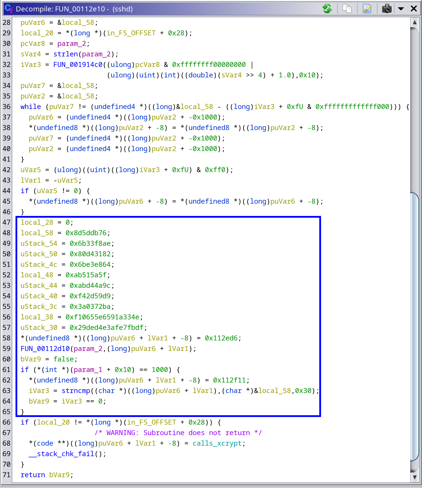

# First Responder

Author: `Mr. Blade`

## Description

One of our client companies was recently hit with a cyber attack. During the initial investigation by our incident responders, a recently modified sshd binary was discovered. 

Can you check if the attackers installed a backdoor in sshd?

Note: The username you need to use is `billy`.

## Solution

Static analysis is cool!!

Our goal is to find a backdoor in this version of sshd

Open up ghidra and analyze the binary. Stripped binary... not poggers

Let's look at the 2 functions we're given symbols for.

`setlogin` doesn't look too helpful...

`xcrypt` seems to be doing normal crypto stuff... kinda gross

Makes sense for sshd to be calling crypto functions. Looking at the functions that call `xcrypt` (boxed above), there's only one real function that calls it: `FUN_00112f30`. That function (renamed `calls_xcrypt`) looks like this:

Seems as if the function either returns a 1 or 0 depending on the branch it enters. Let's go to the function that calls this one (boxed above): `FUN_00112fe0` (renamed `calls_calls_xcrypt`... very creative, I know).

So this function takes the return value of `calls_xcrypt` and explicitly checks to see if it is not equal to 0 (line 31). Looks like it's expecting a 1, but Ghidra decompilation can't guarantee that. Let's go back into `calls_xcrypt`.

The highlighted variable is the output of `xcrypt`. It gets compared to a string that originates from `param_1` and checks for equality (blue box above). That branch returns a 1. It seems from the past 2 observations that the goal is for `calls_xcrypt` to return a 1 upon success. Looking more closely, it seems as if there are 2 more branches that return a 1 (green boxes above). The `iVar3` seems to always be the output of `FUN_00112e10`. The `__s2` output can either be `lVar2 + 8` or the output of `FUN_0018b1b0`. That function looks like this:

Nothing special here. Let's look at `FUN_00112e10`:

Now this is *significantly* more interesting! The boxed section seems to be the most important part. Looks like there are a ton of constants defined and a `strncmp` gets called to check for equality. To return a 1, `iVar3` needs to be equivalent to 0, meaning the 2 values being string compared needs to match. At line 28, `puVar6` gets assigned to the address of `local_58`, the start of this mysterious constant. I'm making a few assumptions here, but I am going to assume that this function passes the user-provided sshd password (`param_2`) and a pointer to an array to `FUN_00112d10`, and then checks if that array's contents are equivalent to the constant defined in memory. Now let's look at that function:

Alright, we have an encrypt function! Seems like we have more library functions. Looks like we are working with AES-256-CBC. If we hover over `EVP_EncryptInit_ex`, it shows the expected argument order: ctx, cipher, impl, key, and iv. From this, we can infer that `local_58` is the key and `local_68` is the iv, so we can rename those variables. Looking at the 2 functions at lines 18 and 19, we see these:

We can generate these values on our own through CyberChef, nice. Now we have all of the information we need. Since the password is encrypted with AES-256-CBC and then compared to the constant, we can decrypt the constant with these values and figure out the backdoor's password. Lets move to CyberChef.

We can generate the key and iv using those arguments passed into those functions:

We get a key of `0465b928c7c5c8b45a7c870c4616aeb14ab613ee4ee00645d755832da2fbb5d8` and an IV of `45cecb952247930bd13c7bbf9a71a5b0`. Now we can get the constant value from Ghidra.

***NOTE:*** The Ghidra disassembly output isn't entirely accurate here. To get accurate endianness and values, you have to grab the values directly from the assembly. You can do that by looking at the assembly used to load the constant values and following to the data segments where it grabs them from:

When you grab all the values, you should have a ciphertext of `76db5d8daef8336b8231d48064e8e36b5f5a51ab9c4ad4abd9592df4ba72033a4e331a59e65506f1dffbe7afe3d4de29`

Plugging all of these values into CyberChef's AES Decrypt, we can decrypt the ciphertext:

We can see the password is `n07_4_backd00r_p455w0rd_lmao69420`! Now we can try to ssh into `billy`'s account as per the README.

We can successfully log in and get the flag!

Flag: `gigem{n0t_s0_hidd3n_i_gu3ss}`
